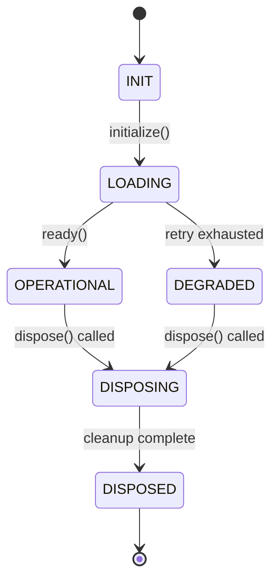

# Desktop Service Implementation Patterns — Generation Template

> **Domain:** implementation
> **Section:** service_patterns
> **Source:** `documentation-standards/13-implementation-standards.md` §Service Patterns
> **Relationships:** `audit/deterministic/document/13-implementation-relationships.yaml`

Generate the Desktop Service Implementation Patterns section for an Implementation Plan document.

## Relationships

| Relationship | Target | Constraint |
|---|---|---|
| `derives_from` | architecture / component_model | Service patterns must implement the process isolation model (Main/Renderer/Preload) |
| `derives_from` | architecture / communication_paths | IPC service wrappers must align with Architecture communication paths |
| `derives_from` | feature-technical / component_responsibilities | Each service must fulfill responsibilities defined in Feature Technical(10) |
| `derives_from` | security / data_classification | Service storage domains (Local/Vault/Document) must enforce data classification |

## Template

```markdown
## Desktop Service Implementation Patterns

### Service Registry Pattern

| Service Name | Factory Type | Process | Singleton | Dependencies | Storage Domain |
|-------------|-------------|---------|-----------|--------------|---------------|
| [ServiceName] | [Factory type] | [Main/Renderer/Preload] | [yes/no] | [dependency list] | [Local/Vault/Document] |

**Factory pattern definition:**

```typescript
// Service factory — singleton instantiation with lifecycle
interface ServiceFactory<T> {
  readonly serviceName: string;
  readonly processTarget: 'main' | 'renderer' | 'preload';
  readonly storageDomain: 'local' | 'vault' | 'document';
  create(config: ServiceConfig): T;
  dispose(service: T): Promise<void>;
}

// Registry — central service locator
class ServiceRegistry {
  private static factories = new Map<string, ServiceFactory<unknown>>();
  private static instances = new Map<string, unknown>();

  static register<T>(factory: ServiceFactory<T>): void;
  static resolve<T>(serviceName: string): T;
  static async disposeAll(): Promise<void>;
}
```

### Service Lifecycle Management

| Phase | Entry Point | Precondition | Postcondition | Failure Behavior |
|-------|------------|--------------|---------------|-----------------|
| INIT | `ServiceFactory.create(config)` | Config loaded, process ready | Service object instantiated, not yet active | Throw `ServiceInitError`, do not register |
| LOADING | `service.initialize()` | INIT complete | Resources acquired (DB handles, IPC channels, file watchers) | Retry 3x with exponential backoff; then mark DEGRADED |
| OPERATIONAL | `service.ready()` signal | LOADING complete | Service accepting requests, event subscriptions active | None (steady state) |
| DISPOSING | `ServiceRegistry.dispose(service)` | Graceful shutdown triggered | Resources released, IPC handlers removed, file handles closed | Force close with warning log; do not block shutdown |
| DISPOSED | Post-dispose cleanup | DISPOSING complete | Service object eligible for GC | None |

**Lifecycle state machine:**



### IPC Service Wrapper

| Pattern | Implementation | Use Case |
|---------|---------------|----------|
| `invoke` (request/response) | `ipcRenderer.invoke('domain:action', payload)` → `ipcMain.handle('domain:action', handler)` | Synchronous-feeling async operations: file read, config query |
| `send` (fire-and-forget) | `ipcRenderer.send('domain:action', payload)` → `ipcMain.on('domain:action', handler)` | Notifications, telemetry, non-critical side effects |
| `receive` (push from main) | `ipcMain.webContents.send('domain:event', payload)` → `ipcRenderer.on('domain:event', handler)` | Progress updates, state change notifications, real-time data |

**Channel naming convention:** `{domain}:{action}` — e.g., `storage:read`, `config:write`, `update:check`

**IPC wrapper implementation:**

```typescript
// Typed IPC service wrapper
class IPCService {
  private channelPrefix: string;

  constructor(domain: string) {
    this.channelPrefix = domain;
  }

  // Request/response via invoke
  async invoke<TRequest, TResponse>(
    action: string,
    payload: TRequest,
    options?: { timeout?: number; retries?: number }
  ): Promise<TResponse>;

  // Fire-and-forget via send
  send<TRequest>(action: string, payload: TRequest): void;

  // Subscribe to push events
  on<TPayload>(event: string, handler: (payload: TPayload) => void): () => void;
}
```

### Event System Integration

| Pattern | Mechanism | Scope | Use Case |
|---------|----------|-------|----------|
| Pub/Sub (in-process) | EventEmitter | Single process | Internal service coordination, UI state updates |
| IPC Event Bridge | `ipcMain`/`ipcRenderer` | Cross-process | Main→Renderer state sync, Renderer→Main command dispatch |
| Global Event Bus | Shared module across processes | App-wide | System-wide notifications (update available, auth change) |

**Event wiring pattern:**

```typescript
// Service subscribes to cross-process events
class NotificationService {
  constructor(private ipc: IPCService) {
    // Subscribe to main-process events
    this.ipc.on('storage:changed', this.handleStorageChange.bind(this));
    this.ipc.on('update:available', this.handleUpdateAvailable.bind(this));
  }

  // Emit to renderer
  notify(title: string, body: string): void {
    this.ipc.send('notification:show', { title, body });
  }
}
```

### Service Dependency Injection

| Pattern | Implementation | Advantage |
|---------|---------------|-----------|
| Constructor injection | Pass dependencies via constructor params | Explicit, testable, compile-time safe |
| Service locator | `ServiceRegistry.resolve<T>(name)` | Loose coupling, dynamic resolution |
| Module-level factory | Exported factory function | Simple, no DI container needed |

**Recommended approach:** Constructor injection for services with ≤3 dependencies; Service locator for cross-cutting concerns (logging, config, storage).

```typescript
// Constructor injection
class FileService {
  constructor(
    private storage: StorageService,
    private logger: LoggerService,
    private config: ConfigService
  ) {}
}

// Service locator for cross-cutting concerns
class AnalyticsService {
  private get logger() { return ServiceRegistry.resolve<LoggerService>('logger'); }
  private get config() { return ServiceRegistry.resolve<ConfigService>('config'); }
}
```

### Configuration Lock Pattern

| Phase | Config State | Mutation Allowed | Access Pattern |
|-------|-------------|-----------------|---------------|
| Pre-operational | Mutable | Yes — config loaded, validated, patched | `config.get(key)` returns current value |
| Operational | Immutable | No — all mutations rejected with `ConfigLockedError` | `config.get(key)` returns frozen value |
| Disposed | Read-only | No — service shut down, config released | `config.get(key)` throws `ServiceDisposedError` |

### Storage Domain Mapping

| Domain | `app.getPath()` | Encryption | Sync | Use Case |
|--------|-----------------|------------|------|----------|
| Local | `userData` | No | No | App cache, UI state, session data |
| Vault | `userData/vault` | Yes (OS keychain) | No | Credentials, API keys, tokens |
| Document | `app.getPath('documents')/appName` | Optional | User-initiated | User files, exports, documents |

### Error Handling Patterns

| Error Type | Pattern | Recovery | User Impact |
|-----------|---------|----------|-------------|
| ServiceInitError | Throw at INIT phase | App falls back to degraded mode | Feature unavailable |
| ServiceTimeoutError | Retry with backoff, then DEGRADED | Automatic retry | Feature degraded, retry indicator |
| IPCChannelError | Log + reconnect | Automatic reconnection | Brief UI freeze |
| ConfigLockedError | Reject mutation, log warning | None | Config change silently dropped |
| StorageQuotaError | Prompt user, offer cleanup | User-driven | Storage warning dialog |
| ProcessCrashError | Detect via `process.on('uncaughtException')` | Auto-restart service | Brief interruption |
```

## Examples

**Correct:**
> ### Service Registry Pattern
>
> | Service Name | Factory Type | Process | Singleton | Dependencies | Storage Domain |
> |-------------|-------------|---------|-----------|--------------|---------------|
> | StorageService | SyncFactory | Main | yes | ConfigService | Local |
> | AuthService | AsyncFactory | Main | yes | StorageService, LoggerService | Vault |
> | UIService | RendererFactory | Renderer | no | IPCService, AuthService | Local |
>
> StorageService uses the `storage:read` and `storage:write` IPC channels. AuthService wraps vault-encrypted storage with `invoke` for synchronous credential reads and `send` for async audit log writes. UIService subscribes to `config:changed` events to re-render on configuration updates.

**Incorrect:**
> Services are created as needed and use global variables for state. Each service communicates via raw `ipcRenderer.send` and `ipcMain.on` without channel naming conventions. Services clean up on process exit.
> *Why wrong: services must follow the registry pattern with explicit factory types and process targets; IPC channels must use the `{domain}:{action}` naming convention; lifecycle management must include explicit INIT→LOADING→OPERATIONAL→DISPOSING phases, not rely on process exit.*

## Writing Guidance

- **Tone:** technical
- **Voice:** imperative
- **Structure:** tables, code blocks
- **Audience:** engineer
- **Do:** Define the service registry pattern with factory types and process targets; specify lifecycle phases with entry points, preconditions, postconditions, and failure behavior; detail IPC wrapper patterns (invoke/send/receive) with channel naming conventions; describe event system integration with scope; provide dependency injection patterns; define the configuration lock pattern; map storage domains; specify error handling with recovery and user impact
- **Don't:** Use global mutable state for service coordination; skip lifecycle phase definitions; use ad-hoc channel names without the `{domain}:{action}` convention; mix process targets without explicit labeling; omit error handling patterns

**Required subsections:** Service Registry Pattern, Service Lifecycle Management, IPC Service Wrapper, Event System Integration
**Optional subsections:** Service Dependency Injection, Configuration Lock Pattern, Storage Domain Mapping, Error Handling Patterns
**Required diagrams:** lifecycle state machine
**Required cross-references:** Architecture(05), Feature Technical(10), Security(03), Engineering(07)

## Audit Fix

<!-- Phase 5: populate with finding→generation handoff -->
