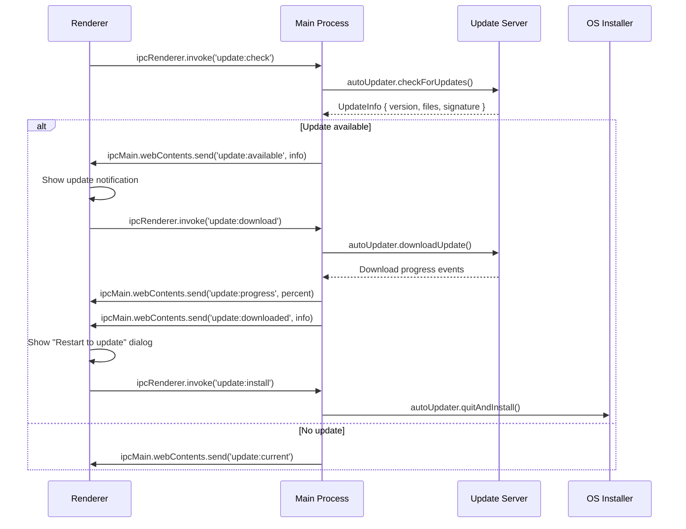

# Auto-Update Implementation — Generation Template

> **Domain:** build
> **Section:** auto_update
> **Source:** `documentation-standards/14-build-standards.md` §Auto-Update
> **Relationships:** `audit/deterministic/document/14-build-relationships.yaml`

Generate the Auto-Update Implementation section for a Build Plan document.

## Relationships

| Relationship | Target | Constraint |
|---|---|---|
| `derives_from` | engineering / build_standards | Update mechanism must align with Engineering(07) release pipeline |
| `derives_from` | architecture / component_model | Update check runs in Main process; UI notification runs in Renderer |
| `derives_from` | security / threat_model | Update artifacts must be signed and integrity-verified before install |

## Template

```markdown
## Auto-Update Implementation

### electron-updater Configuration

```yaml
# electron-builder.yml — update config
publish:
  provider: [generic | github | s3 | space]
  url: [update-server-url]
  channel: [stable | beta | alpha]
  owner: [github-owner]
  repo: [github-repo]
  token: ${GH_TOKEN}

updater:
  autoDownload: true
  autoInstallOnAppQuit: true
  allowDowngrade: false
  forceDevUpdate: false
  updaterCacheDirName: [app-name]-updater

  # Differential update config
  differential:
    enabled: true
    maxBlockers: 3

  # Signature verification
  signatureVerification:
    enforced: true
    publicKey: |
      -----BEGIN PUBLIC KEY-----
      [base64-encoded Ed25519 public key]
      -----END PUBLIC KEY-----
```

### Update Flow



### Update Server Configuration

| Provider | Setup | Pros | Cons |
|----------|-------|------|------|
| GitHub Releases | Tag-based releases, `${GH_TOKEN}` auth | Zero infrastructure, built-in electron-builder support | Rate limits, no analytics |
| Generic (S3/MinIO) | HTTP server with `latest.yml` + artifacts | Full control, private hosting | Requires server management |
| S3 | `publish.provider: s3` | Scalable, CDN-friendly | AWS cost, IAM management |
| Static hosting | Nginx/Apache serving `latest.yml` + files | Simple, no external deps | Manual upload process |

**`latest.yml` format (generated by electron-builder):**

```yaml
version: 1.2.3
files:
  - url: myapp-1.2.3.exe
    sha512: [hash]
    size: 12345678
path: myapp-1.2.3.exe
sha512: [hash]
releaseDate: '2026-07-15T00:00:00.000Z'
```

### Differential Updates

| Aspect | Detail |
|--------|--------|
| Mechanism | `electron-updater` blockmap-based diff |
| File | `${productName}-${version}.blockmap` (binary diff of asar + resources) |
| Download size | ~5-15% of full package for minor versions |
| Fallback | Full download if differential patch fails (>3 corrupted blocks) |
| Verification | SHA-512 hash check on patched output before install |
| Compatibility | Same major Electron version required; cross-major = full download |

### Update Channels

| Channel | Version Pattern | Update Frequency | Stability | Target Audience |
|---------|----------------|-----------------|-----------|----------------|
| `stable` | `x.y.z` | Every 2-4 weeks | Highest | Production users |
| `beta` | `x.y.z-beta.N` | Weekly | High | Beta testers, early adopters |
| `alpha` | `x.y.z-alpha.N` | Daily | Medium | Developers, QA |
| `dev` | Local build | On-demand | Variable | Core developers |

**Channel switching logic:**

```typescript
// Main process — determine update channel
function getUpdateChannel(): string {
  const configChannel = config.get('update.channel');
  if (configChannel) return configChannel;

  // Detect from app version
  const version = app.getVersion();
  if (version.includes('-alpha')) return 'alpha';
  if (version.includes('-beta')) return 'beta';
  return 'stable';
}
```

### Rollback Mechanism

| Scenario | Rollback Strategy | Data Preservation |
|----------|------------------|-------------------|
| Update download fails | Continue running current version, retry next launch | All local data preserved |
| Update install fails | Re-launch previous version from backup, show error dialog | All local data preserved |
| Post-update crash (first launch) | Detect crash within 30s of update; offer "Roll back to previous version" | User data preserved; update data reverted |
| User-initiated rollback | Settings → Advanced → "Revert to version X" | User data preserved; app config may need re-setup |
| Corrupted update | SHA-512 verification fails → discard download, retry | All data preserved |

**Crash detection for auto-rollback:**

```typescript
// Main process — post-update crash sentinel
const UPDATE_MARKER = path.join(app.getPath('userData'), '.update-pending');
const CRASH_THRESHOLD_MS = 30_000;

app.on('ready', () => {
  if (fs.existsSync(UPDATE_MARKER)) {
    const stat = fs.statSync(UPDATE_MARKER);
    const elapsed = Date.now() - stat.mtimeMs;
    if (elapsed < CRASH_THRESHOLD_MS) {
      // Crashed shortly after update — trigger rollback
      logger.warn('Post-update crash detected, offering rollback');
      BrowserWindow.getAllWindows()[0].webContents.send('update:rollback-offer');
    }
    fs.unlinkSync(UPDATE_MARKER);
  }
});

// Before install
autoUpdater.on('update-downloaded', () => {
  fs.writeFileSync(UPDATE_MARKER, Date.now().toString());
});
```

### User Notification

| Event | Notification Type | UI Element | User Action |
|-------|------------------|------------|-------------|
| Update available | Non-blocking banner | Toast/notification bar | "Update available — details" |
| Update downloaded | Modal dialog | "Restart to update" dialog | "Restart now" / "Later" |
| Update failed | Error dialog | Non-blocking error toast | "Retry" / "Dismiss" |
| Update current | None (or subtle "up to date") | Status bar indicator | None |
| Rollback offered | Modal dialog | "Revert to previous version" | "Revert" / "Keep current" |

### Update Security

| Check | Implementation | Failure Behavior |
|-------|---------------|-----------------|
| Signature verification | Ed25519 signature on `latest.yml` + artifacts | Reject update, log warning |
| HTTPS transport | All update server requests over TLS | Reject non-HTTPS responses |
| Hash verification | SHA-512 on downloaded artifact before install | Discard artifact, retry |
| Integrity check | Verify asar + resource hashes post-patch | Fall back to full download |
| Version pinning | `allowDowngrade: false` prevents downgrade attacks | Reject lower version numbers |
| Certificate pinning | Optional: pin update server certificate | Reject connections to unpinned servers |

### Platform-Specific Update Behavior

| Behavior | Windows | macOS | Linux |
|----------|---------|-------|-------|
| Update mechanism | NSIS: `quitAndInstall()` | DMG: quit + install + relaunch | AppImage: `quitAndInstall()` replaces binary |
| Permission required | Per-machine: admin; per-user: none | None (drag-to-install) | Depends on install location |
| Background download | Yes, via `electron-updater` | Yes, via `electron-updater` | Yes, via `electron-updater` |
| System restart | No (app restart only) | No (app restart only) | No (app restart only) |
| Code signing re-verification | Verify new binary signature | Verify new binary + notarization | N/A |
| Cached update cleanup | Delete old installer from `%LOCALAPPDATA%` | Delete `.dmg` from cache dir | Delete old AppImage from cache |

### Update Telemetry

| Event | Payload | Purpose |
|-------|---------|---------|
| `update:check-started` | `{channel, currentVersion}` | Track check frequency |
| `update:available` | `{channel, currentVersion, targetVersion, size}` | Track adoption rate |
| `update:download-started` | `{channel, targetVersion, downloadSize}` | Track download initiation |
| `update:download-progress` | `{channel, targetVersion, percent, bytesPerSecond}` | Track download performance |
| `update:downloaded` | `{channel, targetVersion, downloadDurationMs}` | Track download completion |
| `update:installed` | `{channel, previousVersion, targetVersion, installMethod}` | Track installation success |
| `update:failed` | `{channel, targetVersion, error, errorType}` | Track failure modes |
| `update:rollback` | `{channel, rolledBackFrom, rolledBackTo, reason}` | Track rollback frequency |
```

## Examples

**Correct:**
> ### electron-updater Configuration
>
> | Aspect | Configuration |
> |--------|--------------|
> | Provider | GitHub Releases |
> | Channel | `stable` (production), `beta` (beta testers) |
> | Auto-download | `true` — updates downloaded silently in background |
> | Auto-install on quit | `true` — pending updates install on app quit |
> | Differential updates | Enabled, blockmap-based, ~10% download size for minor versions |
> | Signature verification | Ed25519 enforced; reject unsigned updates |
>
> Update flow: Main process checks GitHub Releases for `latest.yml`. If a newer version exists matching the current channel, `electron-updater` downloads the differential blockmap. Renderer receives `update:downloaded` and shows "Restart to update" dialog. On restart, `quitAndInstall()` replaces the binary and relaunches. Post-update crash detection: if the app crashes within 30 seconds of an update, a rollback dialog offers reversion to the previous version.

**Incorrect:**
> Use electron-updater to check for updates. Download the update and install it when the user clicks a button. If something goes wrong, the user can reinstall the old version manually.
> *Why wrong: auto-update implementation must define the complete update flow (check → download → verify → install → rollback), differential update configuration, update channel strategy, rollback mechanisms (including automatic post-update crash detection), user notification at each event, security verification (signature, hash, HTTPS), and platform-specific update behavior.*

## Writing Guidance

- **Tone:** technical
- **Voice:** imperative
- **Structure:** tables, code blocks, diagrams
- **Audience:** engineer
- **Do:** Define electron-updater configuration with publish provider, channel, differential updates, and signature verification; diagram the update flow across processes; describe update server configuration with `latest.yml` format; specify differential update mechanics; define update channels with version patterns; detail rollback mechanisms including crash-based auto-rollback; specify user notification at each update event; list security checks; describe platform-specific update behavior; define update telemetry events
- **Don't:** Skip rollback mechanism design; omit differential update configuration; leave update security undefined (signature, hash, HTTPS); use vague notification descriptions; skip platform-specific update differences

**Required subsections:** electron-updater Configuration, Update Flow, Update Channels, Rollback Mechanism, Update Security
**Optional subsections:** Update Server Configuration, Differential Updates, User Notification, Platform-Specific Update Behavior, Update Telemetry
**Required diagrams:** update flow sequence diagram
**Required cross-references:** Engineering(07), Architecture(05), Security(03), Packaging section

## Audit Fix

<!-- Phase 5: populate with finding→generation handoff -->
