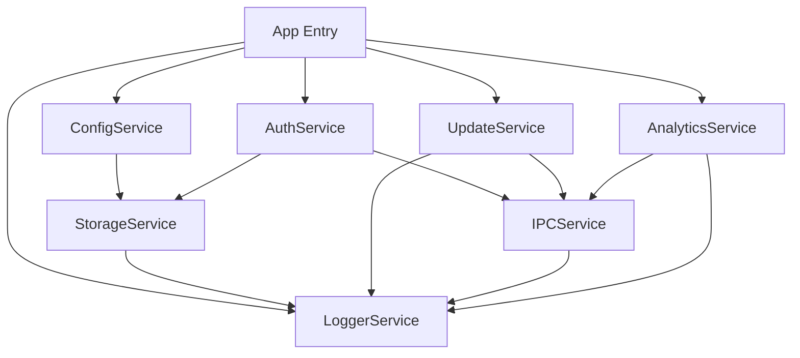

# Desktop Service Catalog — Generation Template

> **Domain:** product-guide
> **Section:** service_catalog
> **Source:** `documentation-standards/16-product-guide-standards.md` §Service Catalog
> **Relationships:** `audit/deterministic/document/16-product-guide-relationships.yaml`

Generate the Desktop Service Catalog section for a Product Guide document.

## Relationships

| Relationship | Target | Constraint |
|---|---|---|
| `derives_from` | architecture / component_model | Service directory must map to Architecture process model (Main/Renderer/Preload) |
| `derives_from` | implementation / service_patterns | Service lifecycle documentation must follow Implementation service patterns |
| `traces_to` | feature / purpose | Service capabilities must trace to Feature requirements |

## Template

```markdown
## Desktop Service Catalog

### Service Directory

| Service | Process | Description | Storage Domain | Status |
|---------|---------|-------------|---------------|--------|
| [ServiceName] | [Main/Renderer/Preload] | [What the service does] | [Local/Vault/Document] | [operational/deprecated] |

### IPC Channel Reference

| Channel | Direction | Payload | Response | Process Target | Error Handling |
|---------|-----------|---------|----------|---------------|---------------|
| `{domain}:{action}` | [Renderer→Main / Main→Renderer] | `{key: type}` | `{key: type}` | [Main / Renderer] | [error type + recovery] |

### Service Lifecycle Guide

| Phase | Entry Point | Precondition | Postcondition | User Observable |
|-------|------------|--------------|---------------|----------------|
| INIT | Service factory invoked | Config loaded | Service object created | None (background) |
| LOADING | `service.initialize()` | INIT complete | Resources acquired | Loading indicator (optional) |
| OPERATIONAL | `service.ready()` signal | LOADING complete | Service accepting requests | Feature available |
| DISPOSING | Graceful shutdown | Shutdown triggered | Resources released | Feature unavailable |
| DISPOSED | Post-dispose | DISPOSING complete | Service GC'd | None |

### Service Usage Patterns

#### Pattern: Invoke (Request/Response)

Use for synchronous-feeling async operations.

```typescript
// Renderer process
const result = await window.electronAPI.invoke('storage:read', {
  domain: 'local',
  key: 'user-preferences'
});
// result: { theme: 'dark', language: 'en' }
```

```typescript
// Main process handler
ipcMain.handle('storage:read', async (event, payload) => {
  const { domain, key } = payload;
  return storageService.read(domain, key);
});
```

**When to use:** File reads, config queries, data fetches, validation checks.
**When NOT to use:** Fire-and-forget operations, long-running tasks, push notifications.

#### Pattern: Send (Fire-and-Forget)

Use for one-way messages that don't require a response.

```typescript
// Renderer process
window.electronAPI.send('analytics:track', {
  event: 'feature_used',
  properties: { feature: 'export', format: 'pdf' }
});
```

```typescript
// Main process handler
ipcMain.on('analytics:track', async (event, payload) => {
  await analyticsService.track(payload.event, payload.properties);
});
```

**When to use:** Telemetry, logging, state change notifications, background job triggers.
**When NOT to use:** Operations requiring confirmation, data that must be returned to renderer.

#### Pattern: Receive (Push from Main)

Use for main-process-initiated notifications to renderer.

```typescript
// Renderer process
window.electronAPI.on('update:available', (info) => {
  showUpdateNotification(info.version, info.releaseDate);
});
```

```typescript
// Main process — push to renderer
BrowserWindow.getAllWindows().forEach(win => {
  win.webContents.send('update:available', {
    version: '1.2.3',
    releaseDate: '2026-07-15'
  });
});
```

**When to use:** Progress updates, state change broadcasts, system notifications, error alerts.
**When NOT to use:** Renderer-initiated operations, request/response patterns.

### Service API Reference

#### StorageService

| Method | Signature | Returns | Description |
|--------|-----------|---------|-------------|
| `read` | `(domain: string, key: string) → Promise<any>` | Stored value | Read from storage domain |
| `write` | `(domain: string, key: string, value: any) → Promise<void>` | void | Write to storage domain |
| `delete` | `(domain: string, key: string) → Promise<void>` | void | Delete from storage domain |
| `list` | `(domain: string) → Promise<string[]>` | Array of keys | List all keys in domain |
| `clear` | `(domain: string) → Promise<void>` | void | Clear all keys in domain |

#### ConfigService

| Method | Signature | Returns | Description |
|--------|-----------|---------|-------------|
| `get` | `(key: string) → any` | Configuration value | Get config value (synchronous) |
| `getAll` | `() → Record<string, any>` | Full config object | Get all configuration |
| `set` | `(key: string, value: any) → void` | void | Set config (pre-operational only) |
| `lock` | `() → void` | void | Lock config (post-operational) |
| `onChange` | `(key: string, handler: Function) → () => void` | Unsubscribe function | Subscribe to config changes |

#### AuthService

| Method | Signature | Returns | Description |
|--------|-----------|---------|-------------|
| `login` | `(credentials: Credentials) → Promise<AuthResult>` | Auth token | Authenticate user |
| `logout` | `() → Promise<void>` | void | Clear auth state |
| `getToken` | `() → Promise<string \| null>` | Current token | Get current auth token |
| `refresh` | `() → Promise<AuthResult>` | New token | Refresh expired token |
| `onAuthChange` | `(handler: Function) → () => void` | Unsubscribe function | Subscribe to auth state changes |

#### UpdateService

| Method | Signature | Returns | Description |
|--------|-----------|---------|-------------|
| `check` | `() → Promise<UpdateInfo \| null>` | Update info or null | Check for available update |
| `download` | `() → Promise<void>` | void | Download available update |
| `install` | `() → void` | void | Install downloaded update and restart |
| `getVersion` | `() → string` | Current version | Get current app version |
| `onProgress` | `(handler: Function) → () => void` | Unsubscribe function | Subscribe to download progress |
| `onDownloaded` | `(handler: Function) → () => void` | Unsubscribe function | Subscribe to download completion |

#### LoggerService

| Method | Signature | Returns | Description |
|--------|-----------|---------|-------------|
| `info` | `(message: string, context?: object) → void` | void | Log info-level message |
| `warn` | `(message: string, context?: object) → void` | void | Log warning message |
| `error` | `(message: string, error?: Error, context?: object) → void` | void | Log error with stack trace |
| `debug` | `(message: string, context?: object) → void` | void | Log debug message (dev only) |
| `getLogFile` | `() → Promise<string>` | Log file path | Get path to current log file |

### Service Dependency Map



### Error Reference

| Service | Error | Meaning | Recovery |
|---------|-------|---------|----------|
| StorageService | `StorageQuotaError` | Storage limit exceeded | Prompt user to clear data |
| StorageService | `StorageCorruptError` | Data integrity check failed | Rebuild from backup |
| ConfigService | `ConfigLockedError` | Config mutation after lock phase | Wait for next restart |
| AuthService | `AuthTokenExpiredError` | Access token expired | Call `refresh()` |
| AuthService | `AuthNetworkError` | Cannot reach auth server | Retry with backoff |
| UpdateService | `UpdateSignatureError` | Update signature verification failed | Reject update, log |
| UpdateService | `UpdateNetworkError` | Cannot reach update server | Retry next check cycle |
| LoggerService | `LogWriteError` | Cannot write to log file | Fall back to console |
| IPCService | `IPCChannelError` | IPC handler not registered | Re-register handler |
| IPCService | `IPCTimeoutError` | Handler did not respond in time | Retry or return default |
```

## Examples

**Correct:**
> ### Service Directory
>
> | Service | Process | Description | Storage Domain | Status |
> |---------|---------|-------------|---------------|--------|
> | StorageService | Main | Manages local and vault storage with encryption | Local / Vault | operational |
> | AuthService | Main | Handles authentication, token management, and session | Vault | operational |
> | ConfigService | Main | Application configuration with lock phases | Local | operational |
> | UpdateService | Main | Auto-update check, download, install | Local | operational |
> | IPCService | Main + Renderer | Typed IPC wrapper for cross-process communication | N/A | operational |
>
> ### IPC Channel Reference
>
> | Channel | Direction | Payload | Response | Process Target | Error Handling |
> |---------|-----------|---------|----------|---------------|---------------|
> | `storage:read` | Renderer→Main | `{domain: string, key: string}` | `{value: any}` | Main | `StorageCorruptError` → rebuild |
> | `auth:login` | Renderer→Main | `{email: string, password: string}` | `{token: string}` | Main | `AuthNetworkError` → retry 3x |
> | `update:check` | Renderer→Main | `{}` | `{version: string} \| null` | Main | `UpdateNetworkError` → retry next cycle |
>
> ### Service Usage Patterns
>
> Use `invoke` for operations that return data (config reads, storage queries). Use `send` for side effects (analytics, logging). Use `receive` for push notifications (update available, auth state change).

**Incorrect:**
> Services: Storage, Auth, Config, Update. They talk to each other over IPC. Check the source code for channel names and method signatures.
> *Why wrong: service catalog must define a service directory with process targets and storage domains, an IPC channel reference with payload/response schemas, a lifecycle guide, service API reference with method signatures, usage patterns with code examples, a dependency map, and an error reference with recovery strategies.*

## Writing Guidance

- **Tone:** conversational
- **Voice:** second person
- **Structure:** tables, code blocks
- **Audience:** developer / AI agent
- **Do:** Define a service directory with process targets, storage domains, and status; provide an IPC channel reference with direction, payload, response, and error handling; document the service lifecycle with user-observable behavior; describe usage patterns (invoke/send/receive) with code examples and when-to-use guidance; include a service API reference with method signatures; draw a dependency map; define an error reference with recovery strategies
- **Don't:** Omit IPC channel payloads or error handling; skip code examples for usage patterns; use implementation-internal terminology in descriptions; omit the service dependency map; leave error recovery undefined

**Required subsections:** Service Directory, IPC Channel Reference, Service Lifecycle Guide, Service Usage Patterns
**Optional subsections:** Service API Reference, Service Dependency Map, Error Reference
**Required diagrams:** service dependency map (mermaid graph)
**Required cross-references:** Architecture(05), Implementation(13), Feature(04)

## Audit Fix

<!-- Phase 5: populate with finding→generation handoff -->
