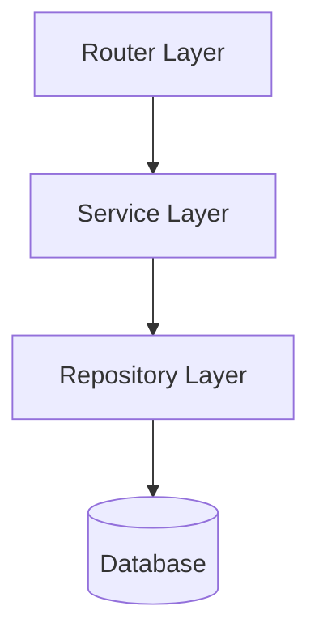

## Layered Architecture

> *Structural rules: `audit/deterministic/section/05-architecture/12-layered_architecture.yaml`*

### Template

> **minimum_content:** 2 paragraphs + 1 diagram
> **length_guidance:** moderate
> **diagram_requirements:** Architecture diagram showing Routers, Services, and Repositories

```markdown
This component follows a strict layered architecture pattern.

[Provide an overview of how responsibilities are distributed across the layers.]



### [Router Name]

[Describe the HTTP entry points, input validation, and response formatting handled by the router layer.]

### [Service Name]

[Describe the core business logic, orchestrating repositories and external clients.]

### [Repository Name]

[Describe the data access abstraction, encapsulating SQL or ORM specifics.]
```

**Required subsections:** Router Name, Service Name, Repository Name
**Optional subsections:** none
**Required diagrams:** Layered Architecture Diagram
**Required cross-references:** Component Model(03)

### Examples

**Correct:**
> The `users` domain strictly separates HTTP concerns from business logic. The `UserRouter` extracts JWT tokens and delegates to `UserService`. The `UserService` applies business rules and coordinates with `UserRepository` to persist data.

**Incorrect:**
> The `users` endpoint directly queries the database using SQLAlchemy and returns the raw rows.
> *Why wrong: Violates the layered architecture by bypassing the Service and Repository layers from the Router.*

### Writing Guidance

- **Tone:** structural
- **Voice:** third person
- **Structure:** paragraphs and mermaid diagrams
- **Audience:** backend engineer
- **Do:** Clearly delineate boundaries and dependency direction.
- **Don't:** Place business logic in the router or HTTP concerns in the service layer.
