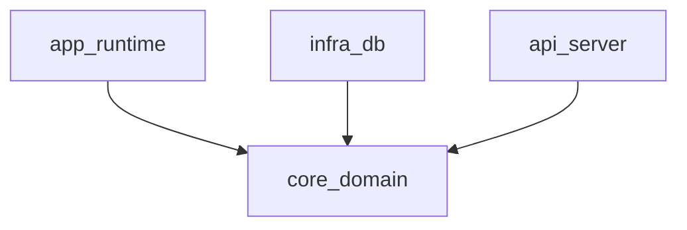

# Crate Architecture — Generation Template

> **Domain:** architecture
> **Section:** crate_architecture
> **Source:** `documentation-standards/05-architecture-standards.md` §CrateArchitecture
> **Relationships:** `audit/deterministic/document/05-architecture-relationships.yaml`

Generate the Crate Architecture section for a Architecture document.

## Relationships

This section has the following outgoing relationships that must be satisfied:

| Relationship | Target | Constraint |
|---|---|---|
| `derives_from` | feature / purpose | Crate Architecture must align with the feature purpose |
| `derives_from` | architecture / component_model | Crate Architecture implements the component model |

> *Structural rules: `audit/deterministic/section/05-architecture/12-crate_architecture.yaml`*

### Template

> **minimum_content:** 2 paragraphs + 1 diagram
> **length_guidance:** moderate
> **diagram_requirements:** Architecture diagram showing Cargo workspace and crates

```markdown
This system is organized as a Cargo workspace with distinct crates enforcing architectural boundaries.

[Describe the workspace structure and the responsibility of each crate.]



## Dependency Direction

[Specify the rules for dependency direction between crates (e.g., infrastructural crates depend on core, never the reverse).]
```

**Required subsections:** Dependency Direction
**Optional subsections:** none
**Required diagrams:** Workspace Architecture Diagram
**Required cross-references:** Component Model(03)

### Examples

**Correct:**
> The `core` crate contains all business logic and traits, and has zero dependencies. The `postgres_impl` crate implements those traits and depends on `core`.

**Incorrect:**
> We just put everything in one crate.
> *Why wrong: Violates the modular crate architecture requirement for systems engineering.*

### Writing Guidance

- **Tone:** structural
- **Voice:** third person
- **Structure:** paragraphs and mermaid diagrams
- **Audience:** systems engineer
- **Do:** Enforce strict dependency direction.
- **Don't:** Allow circular dependencies or tightly coupled crates.

> **Generation note:** When generating this section for a specific system, ensure that the output strictly adheres to the provided writing guidance and focuses on the concrete implementation details rather than meta-level documentation standards.

## Audit Fix

<!-- Phase 5: populate with finding→generation handoff -->
